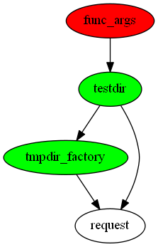

pytest-fixture-tools: Pytest fixture tools plugin
=================================================

The ``pytest-fixture-tools`` package is a pytest plugin which provides various tools for fixture.

.. image:: https://api.travis-ci.org/paylogic/pytest-fixture-tools.png
   :target: https://travis-ci.org/paylogic/pytest-fixture-tools
.. image:: https://pypip.in/v/pytest-fixture-tools/badge.png
   :target: https://crate.io/packages/pytest-fixture-tools/
.. image:: https://coveralls.io/repos/paylogic/pytest-fixture-tools/badge.png?branch=master
   :target: https://coveralls.io/r/paylogic/pytest-fixture-tools

Installation
------------

.. sourcecode::

    pip install pytest-fixture-tools

Usage
-----

show-fixture-duplicates
***********************

If you have already installed ``pytest-fixture-tools`` plugin then you can use one of its commands.

``--show-fixture-duplicates`` - will collect all fixtures and print you a list of duplicates for each fixture.

With ``--show-fixture-duplicates`` you can use ``--fixture name_of_fixture`` option to get list of duplicates only for specific fixture

.. sourcecode::

    py.test tests/ --show-fixture-duplicates --fixture order

Output can look like this:

.. sourcecode::

    ========================================== test session starts ==========================================
    platform linux2 -- Python 2.7.3 -- pytest-2.5.1 -- /home/batman/.virtualenvs/arkham-city/bin/python
    Tests are shuffled using seed number 355495648184.
    cachedir: /home/batman/.virtualenvs/arkham-city/.cache
    plugins: fixture-tools, random, bdd-splinter, pep8, cov, contextfixture, bdd, xdist, instafail, cache
    collected 2347 items / 1 skipped

    ------------------------------------------------- order -------------------------------------------------
    tests/fixtures/order.py:30
    tests/unit/api/conftest.py:261

fixture-graph
*************

You can generate the usage fixture graph like that:

.. sourcecode:: bash

    # on windows gitbash as example
    export PATH=$PATH:/c/Program\ Files\ \(x86\)/Graphviz2.38/bin/
    pytest --fixture-graph -s

    # or you can select the output direcotry like that:
    pytest --fixture-graph --fixture-graph-output-dir=./test_output

    # you can also change the output type of the graphs (any of graphvis supported outputs types):
    pytest --fixture-graph --fixture-graph-output-type=jpg

The output would be like that:

.. sourcecode::

   ============================= test session starts =============================
   platform win32 -- Python 2.7.10, pytest-3.3.1, py-1.5.2, pluggy-0.6.0
   rootdir: C:\Users\ifruchte\Projects\pytest-fixture-tools, inifile: tox.ini
   plugins: pep8-1.0.6, cov-2.5.1, fixture-tools-1.0.0
   collected 7 items

   pytest_fixture_tools\__init__.py .                                       [ 14%]
   pytest_fixture_tools\plugin.py .                                         [ 28%]
   tests\__init__.py .                                                      [ 42%]
   tests\conftest.py .                                                      [ 57%]
   tests\test_fixture_duplicates.py .
   -------------------------------- fixture-graph --------------------------------
   created artifacts/fixture-graph-tests-test_fixture_duplicates.py__test_there_are_fixture_duplicates.png.
   ============================= test session starts =============================
   platform win32 -- Python 2.7.10, pytest-3.3.1, py-1.5.2, pluggy-0.6.0
   rootdir: c:\users\ifruchte\appdata\local\temp\pytest-of-ifruchte\pytest-445\test_there_are_not_fixture_duplicates0, inifile:
   plugins: pep8-1.0.6, cov-2.5.1, fixture-tools-1.0.0
   collected 2 items

   ======================== no tests ran in 0.06 seconds =========================
   .s                                     [100%]

   ===================== 6 passed, 1 skipped in 0.29 seconds =====================

Final output, that can help with tests that depend on large amount of fixtures:

Contact
-------

If you have questions, bug reports, suggestions, etc. please create an issue on
the `GitHub project page <http://github.com/paylogic/pytest-fixture-tools>`_.

License
-------

This software is licensed under the `MIT license <http://en.wikipedia.org/wiki/MIT_License>`_

See `License <https://github.com/paylogic/pytest-fixture-tools/blob/master/LICENSE.txt>`_

© 2013 Paylogic International.
